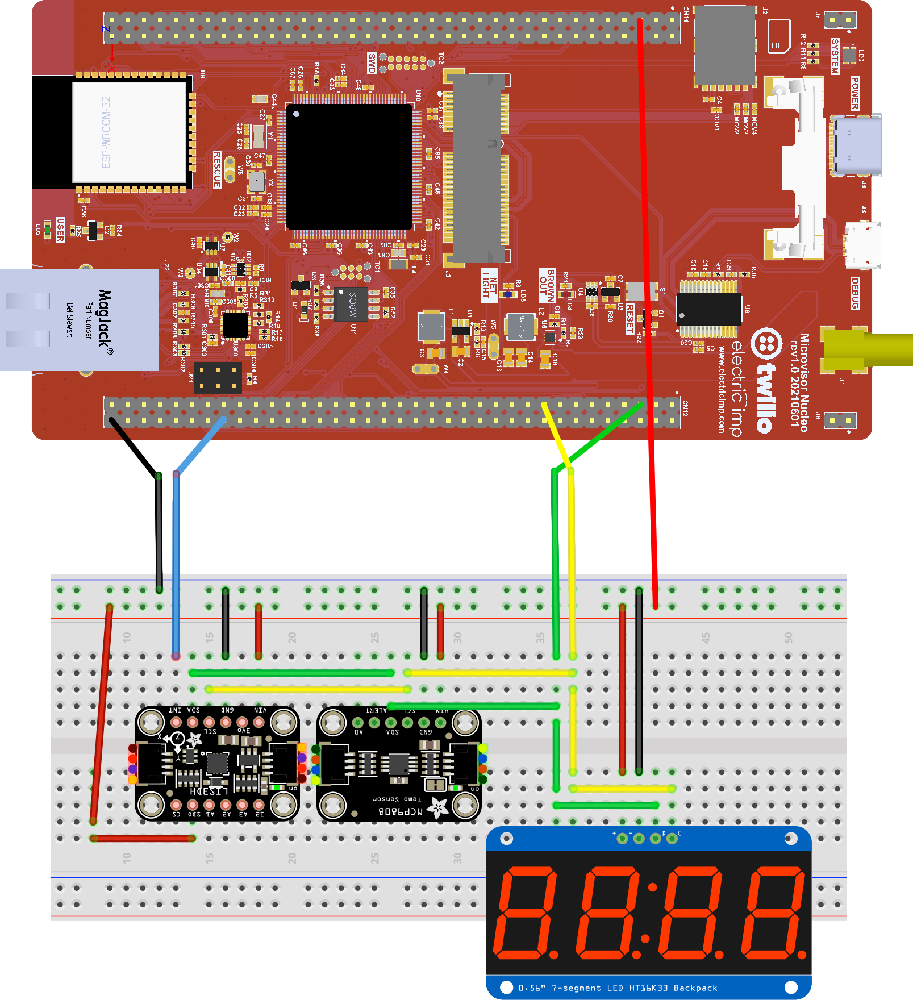
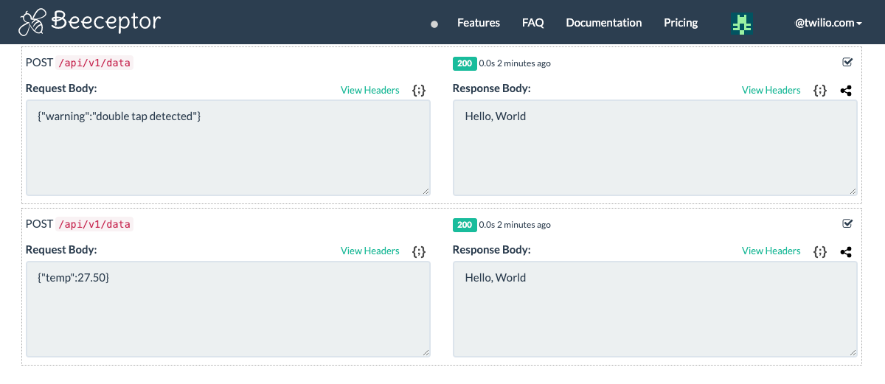

# Twilio Microvisor IoT Device Demo 2.1.4

This repo provides a basic demonstration of a sample IoT device application. It makes use of a temperature sensor and four-digit display to periodically read and present the local temperature. It transmits the data to a mock API. A motion sensor detects double-taps, which trigger warning messages to the mock API.

The application is based on the [FreeRTOS](https://freertos.org/) real-time operating system and which will run on the “non-secure” side of Microvisor. FreeRTOS is included as a submodule.

The [ARM CMSIS-RTOS API](https://github.com/ARM-software/CMSIS_5) is used an an intermediary between the application and FreeRTOS to make it easier to swap out the RTOS layer for another.

The application code files can be found in the [`App/`](App/) directory. The [`ST_Code/`](ST_Code/) directory contains required components that are not part of Twilio Microvisor STM32U5 HAL, which this sample accesses as a submodule. The `FreeRTOSConfig.h` and `stm32u5xx_hal_conf.h` configuration files are located in the [config/](config/) directory.

## Release Notes

Version 2.1.4 makes no code changes but adds support for remote debugging via [Visual Studio Code](https://code.visualstudio.com/).

Version 2.1.0 adds support for an [STMicro LIS3DH accelerometer](https://www.adafruit.com/product/2809) for motion detection.

Version 2.0.0 replaces earlier `printf()`-based application logging with Microvisor’s application logging system calls.

Versions prior to 1.2.0 include a version of the `deploy.sh` script which is no longer compatible with the Microvisor REST API.

## Cloning the Repo

This repo makes uses of git submodules, some of which are nested within other submodules. To clone the repo, run:

```bash
git clone https://github.com/TwilioDevEd/microvisor-iot-device-demo.git
```

and then:

```bash
cd microvisor-iot-device-demo
git submodule update --init --recursive
```

## Repo Updates

When the repo is updated, and you pull the changes, you should also always update dependency submodules. To do so, run:

```bash
git submodule update --remote --recursive
```

We recommend following this by deleting your `build` directory.

## Requirements

You will need a Twilio account. [Sign up now if you don’t have one](https://www.twilio.com/try-twilio).

The demo makes use of [Beeceptor](https://beeceptor.com/) as a target for the HTTP `POST` requests it makes.

You will also need the following hardware:

* A Twilio Microvisor Nucleo Development Board. These are currently only available to Private Beta program participants. You will need to solder male header pins to the two GPIO banks on the board, or at the very least to the connected pins shown in the circuit diagram below.
* An HT16K33-based 4-digit, 7-segment display, e.g., [Adafruit 0.56" 4-Digit 7-Segment Display w/I2C Backpack](https://www.adafruit.com/product/879).
* An MCP9808 temperature sensor, e.g., [Adafruit MCP9808 High Accuracy I2C Temperature Sensor Breakout Board](https://www.adafruit.com/product/5027).
* An STMicro LIS3DH motion sensor, e.g., [Adafruit LIS3DH Triple-Axis Accelerometer](https://www.adafruit.com/product/2809).
## Hardware Setup

Assemble the following circuit:



| Wire Color | GPIO Block | GPIO Pin Number | Microvisor Pin | Role |
| --- | :-: | :-: | :-: | --- |
| Black | CN12 | 72 | N/A | GND |
| Blue | CN12 | 58 | PF3 | LIS3DH interrupt detection |
| Green | CN12 | 5 | PB9 | I2C SDA |
| Yellow | CN12 | 17 | PB6 | I2C SCL |
| Red | CN11 | 5 | N/A | VDD (3V3) |

The display and sensor are shown on breakout boards which include I2C pull-up resistors. If you add the display and sensor as raw components, you will need to add pull-ups on the I2C SDA and SCL lines. You only need a single pull-up on each line.

The Adafruit LIS3DH has an I2C address of `0x18`, the same as the MCP98008. To avoid this clash, connect the `SDO` pin on the Adafruit LIS3DH board to 3V3. This changes the address to `0x19`, and this is used in the sample code.

#### Datasheets

* [MCP9808](http://www.adafruit.com/datasheets/MCP9808.pdf)
* [LIS3DH datasheet](https://www.st.com/resource/en/datasheet/lis3dh.pdf)
* [LIS3DH app note](http://www.adafruit.com/datasheets/LIS3DHappnote.pdf)

## Software Setup

This project is written in C. At this time, we only support Ubuntu 20.0.4. Users of other operating systems should build the code under a virtual machine running Ubuntu.

**Note** macOS users may attempt to install the pre-requisites below using [Homebrew](https://brew.sh). This is not supported, but should work. You may need to change the names of a few of the packages listed in the `apt install` command below.

### Libraries and Tools

Under Ubuntu, run the following:

```bash
sudo apt install gcc-arm-none-eabi binutils-arm-none-eabi \
  git curl build-essential cmake libsecret-1-dev jq openssl
```

### Twilio CLI

Install the Twilio CLI. This is required to view streamed logs and for remote debugging. You need version 4.0.1 or above.

**Note** If you have already installed the Twilio CLI using *npm*, we recommend removing it and then reinstalling as outlined below. Remove the old version with `npm remove -g twilio-cli`.

```bash
wget -qO- https://twilio-cli-prod.s3.amazonaws.com/twilio_pub.asc | sudo apt-key add -
sudo touch /etc/apt/sources.list.d/twilio.list
echo 'deb https://twilio-cli-prod.s3.amazonaws.com/apt/ /' | sudo tee /etc/apt/sources.list.d/twilio.list
sudo apt update
sudo apt install -y twilio
```

Close your terminal window or tab, and open a new one. Now run:

```bash
twilio plugins:install @twilio/plugin-microvisor
```

#### Environment Variables

Running the Twilio CLI and the project's [deploy script](./deploy.sh) — for uploading the built code to the Twilio cloud and subsequent deployment to your Microvisor Nucleo Board — uses the following Twilio credentials stored as environment variables. They should be added to your shell profile:

```bash
export TWILIO_ACCOUNT_SID=ACxxxxxxxxxxxxxxxxxxxxxxxxxxxxxxxx
export TWILIO_AUTH_TOKEN=xxxxxxxxxxxxxxxxxxxxxxxxxxxxxxxx
export MV_DEVICE_SID=UVxxxxxxxxxxxxxxxxxxxxxxxxxxxxxxxx
```

You can get the first two from your Twilio Console [account dashboard](https://console.twilio.com/).

Enter the following command to get your target device’s SID and, if set, its unqiue name:

```bash
twilio api:microvisor:v1:devices:list
```

## Beeceptor Setup

1. [Visit the Beeceptor website](https://beeceptor.com/).
1. Enter an endpoint name and click **Create Endpoint**.
1. Click **Mocking Rules**.
1. Click **Create New Rule**.
1. In the **Mocking Rules** panel:
    1. Set the **Method** to `POST`.
    1. Set the **Request condition** to `Request path starts with`.
    1. Set the path to `/api/v1/data`.
    1. Click **Save Rule**.
1. Close the **Mocking Rules** by clicking the **X** in the top right corner of the panel.
1. Copy the API URL, e.g., `https://<YOUR_ENDPOINT_NAME>.free.beeceptor.com` and set it as the following environment variable. Make sure you include the path from step 5.3, above:

    ```bash
    export MVIOT_URL=https://<YOUR_ENDPOINT_NAME>.free.beeceptor.com/api/v1/data
    ```

## Build and Deploy the Application

Run:

```bash
./deploy.sh --log
```

This will compile, bundle and upload the code, and stage it for deployment to your device. If you encounter errors, please check your stored Twilio credentials.

The `--log` flag initiates log-streaming.

You’ll see these outputs:



The `temp` messages are sent periodically, `warning` messagaes only if you double-tap the LIS3DH.

## View Log Output

You can start log streaming separately — for example, in a second terminal window — with this command:

```bash
./deploy.sh --log-only
```

For more information, run

```bash
./deploy.sh --help
```

## Remote Debugging

This release supports remote debugging, and builds are enabled for remote debugging automatically. Change the value of the line

```
set(ENABLE_REMOTE_DEBUGGING 1)
```

in the root `CMakeLists.txt` file to `0` to disable this.

Enabling remote debugging in the build does not initiate a GDB session — you will have to do this manually. Follow the instructions in the [Microvisor documentation](https://www.twilio.com/docs/iot/microvisor/microvisor-remote-debugging) **Private Beta participants only**

This repo contains a `.gdbinit` file which sets the remote target to localhost on port 8001 to match the Twilio CLI Microvisor plugin remote debugging defaults.

#### Remote Debugging Encryption

Remote debugging sessions are now encrypted. The file `app/CMakeLists.txt` generates new remote debugging keys at each build. These are placed in the `/build/app` directory, which is ignored for git commits. You will need to pass the path to the private key to the Twilio CLI Microvisor plugin to decrypt debugging data. The deploy script will output this path for you.

Alternatively, generate the keys manually and pass their locations to the deploy script:

```shell
./deploy.sh --private-key /path/to/private/key.pem --public-key /path/to/public/key.pem
```

## Copyright and Licensing

The sample code and Microvisor SDK is © 2022, Twilio, Inc. It is licensed under the terms of the [Apache 2.0 License](./LICENSE).

The SDK makes use of code © 2021, STMicroelectronics and affiliates. This code is licensed under terms described in [this file](https://github.com/twilio/twilio-microvisor-hal-stm32u5/blob/main/LICENSE-STM32CubeU5.md).

The SDK makes use [ARM CMSIS](https://github.com/ARM-software/CMSIS_5) © 2004, ARM. It is licensed under the terms of the [Apache 2.0 License](./LICENSE).

[FreeRTOS](https://freertos.org/) is © 2021, Amazon Web Services, Inc. It is licensed under the terms of the [Apache 2.0 License](./LICENSE).
