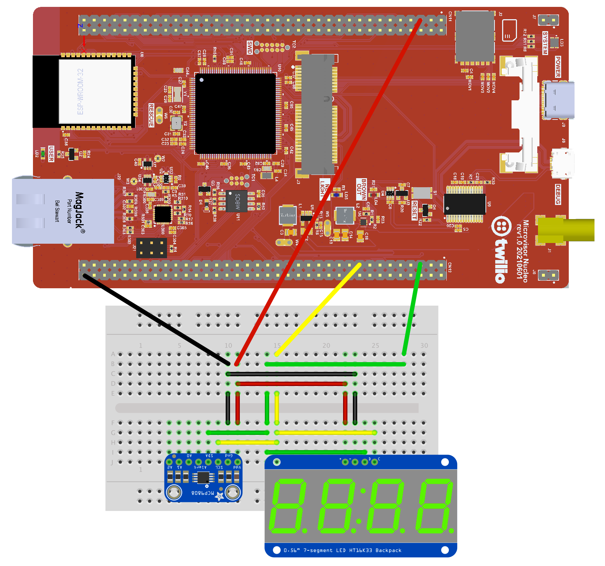

# Twilio Microvisor IoT Device Demo

This repo provides a basic demonstration of a sample IoT device application. It makes use of a temperature sensor and four-digit display to periodically read and present the local temperature. It transmits the data to a mock API.

The application is based on the [FreeRTOS](https://freertos.org/) real-time operating system and which will run on the “non-secure” side of Microvisor. FreeRTOS is included as a submodule.

The application code files can be found in the [`App_Code/`](App_Code/) directory. The [`ST_Code/`](ST_Code/) directory contains required components that are not part of Twilio Microvisor STM32U5 HAL, which this sample accesses as a submodule. The `FreeRTOSConfig.h` and `stm32u5xx_hal_conf.h` configuration files are located in the [config/](config/) directory.

## Cloning the Repo

This repo makes uses of git submodules, some of which are nested within other submodules. To clone the repo, run:

```bash
git clone --recursive https://github.com/TwilioDevEd/microvisor-iot-demo.git
```

## Requirements

You will need a Twilio account. [Sign up now if you don’t have one](https://www.twilio.com/try-twilio).

You will also need the following hardware:

* Twilio Microvisor Nucleo Development Board. These are currently only available to Private Beta program participants. You will need to solder male header pins to the two GPIO banks on the board.
* HT16K33-based 4-digit, 7-segment display.
* MCP9808 temperature sensor.

## Hardware Setup



The display and sensor are provided on boards. These include I2C pull-up resistors. If you add the display and/or sensor as raw components, you will need to add pull-ups on the I2C SDA and SCL lines. You only need a single pull-up on each line.

## Software Setup

This project is written in C. At this time, we only support Ubuntu 20.0.4. Users of other operating systems should build the code under a virtual machine running Ubuntu.

**Note** macOS users may attempt to install the pre-requisites below using [Homebrew](https://brew.sh). This is not supported, but should work. You may need to change the names of a few of the packages listed in the `apt install` command below.

Under Ubuntu, run the following:

```bash
sudo apt install gcc-arm-none-eabi binutils-arm-none-eabi git \
                 python3 python3-pip build-essential protobuf-compiler \
                 cmake libsecret-1-dev curl jq
```

Now run:

```bash
pip3 install cryptography protobuf
```

Install the Twilio CLI (required to view streamed logs):

```bash
curl -o - https://raw.githubusercontent.com/nvm-sh/nvm/master/install.sh | bash
```

Close your terminal window or tab, and open a new one. Now run:

```bash
nvm install --lts
npm install twilio-cli -g
twilio plugins:install @twilio/plugin-microvisor
```

Running the Twilio CLI and the project's [deploy script](./deploy.sh) — for uploading the built code to the Twilio cloud and subsequent deployment to your Microvisor Nucleo Board — uses the following Twilio credentials stored as environment variables. They should be added to your shell profile:

```bash
export TWILIO_ACCOUNT_SID=ACxxxxxxxxxxxxxxxxxxxxxxxxxxxxxxxx
export TWILIO_AUTH_TOKEN=xxxxxxxxxxxxxxxxxxxxxxxxxxxxxxxx
export TWILIO_API_KEY=SKxxxxxxxxxxxxxxxxxxxxxxxxxxxxxxxx
export TWILIO_API_SECRET=YKxxxxxxxxxxxxxxxxxxxxxxxxxxxxxxxx
export MV_DEVICE_SID=UVxxxxxxxxxxxxxxxxxxxxxxxxxxxxxxxx
```

You can get the first two from your Twilio Console [account dashboard](https://console.twilio.com/).

To generate API keys and secrets, visit [**Account > API keys & tokens**](https://twilio.com/console/project/api-keys/).

Restart your terminal and enter the following command:

```bash
curl https://microvisor.twilio.com/v1/Devices \
  -u ${TWILIO_ACCOUNT_SID}:${TWILIO_AUTH_TOKEN} -s | jq
```

This will yield JSON which contains a `device` array — your Microvisor Nucleo Board will be in that array. Use the value of its `sid` field for your `MV_DEVICE_SID` value.

## Build the Code

Build the sample code with:

```bash
cd microvisor-iot-demo
cmake -S . -B build/
cmake --build build --clean-first
```

## Deploy the code

Run:

```bash
./deploy.sh
```

This will upload the build and stage it for deployment to your device. If you encounter errors, please check your stored Twilio credentials.

## View log output

You can start log streaming with this command:

```bash
twilio microvisor:logs:stream ${MV_DEVICE_SID}
```

## Copyright and Licensing

The sample code and Microvisor SDK is © 2022, Twilio, Inc. It is licensed under the terms of the [Apache 2.0 License](./LICENSE).

The SDK makes used of code © 2021, STMicroelectronics and affiliates. This code is licensed under terms described in [this file](https://github.com/twilio/twilio-microvisor-hal-stm32u5/blob/main/LICENSE-STM32CubeU5.md).

FreeRTOS is © 2021, Amazon Web Services, Inc. It is licensed under the terms of the [Apache 2.0 License](./LICENSE).